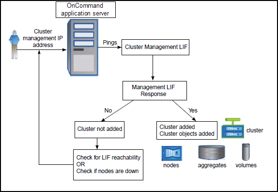

= Cómo funciona el proceso de detección del clúster
:allow-uri-read: 
:icons: font
:imagesdir: ../media/

[role="lead"]
Después de añadir un clúster a Unified Manager, el servidor detecta los objetos del clúster y los añade a su base de datos. Comprender cómo funciona el proceso de detección le permite gestionar los clústeres de su organización y sus objetos.

El intervalo de supervisión para recoger la información de configuración del clúster es de 15 minutos. Por ejemplo, después de agregar un clúster, tarda 15 minutos en mostrar los objetos del clúster en la interfaz de usuario de Unified Manager. Este plazo también se cumple al realizar cambios en un clúster. Por ejemplo, si se añaden dos volúmenes nuevos a una SVM de un clúster, se ven esos objetos nuevos en la interfaz de usuario después del siguiente intervalo de sondeo, que podría ser de hasta 15 minutos.

En la siguiente imagen se muestra el proceso de detección:

Después de detectar todos los objetos de un clúster nuevo, Unified Manager comienza a recopilar datos históricos de rendimiento de los 15 días anteriores. Estas estadísticas se recopilan mediante la funcionalidad de recogida de continuidad de datos. Esta función le proporciona más de dos semanas de información sobre el rendimiento de un clúster inmediatamente después de añadir. Una vez completado el ciclo de recogida de continuidad de datos, se recogen datos de rendimiento del clúster en tiempo real, de forma predeterminada, cada cinco minutos.

[NOTE]
====
Dado que la recogida de 15 días de datos de rendimiento requiere un uso intensivo de la CPU, se sugiere escalonar la adición de nuevos clústeres de manera que las encuestas de recogida de continuidad de datos no se ejecuten en demasiados clústeres al mismo tiempo.

====