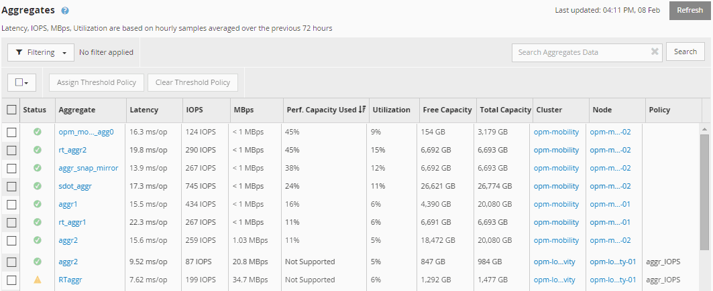

= Ver los valores de capacidad de rendimiento de los nodos y los agregados
:allow-uri-read: 
:icons: font
:imagesdir: ../media/

[role="lead"]
Puede supervisar los valores de capacidad de rendimiento usada para todos los nodos o todos los agregados de un clúster, o bien puede ver detalles de un solo nodo o de un agregado.

Los valores de capacidad utilizada de rendimiento se muestran en las páginas Performance Dashboard, Performance Inventory, la página Top Performers, la página Create Threshold Policy, las páginas Performance Explorer y los gráficos detallados. Por ejemplo, la página Performance/Aggregate Inventory proporciona un rendimiento de columna. Capacidad utilizada para ver el valor de capacidad de rendimiento utilizada de todos los agregados.

El estado «'N/A'» se muestra cuando los nodos no están instalados con el software ONTAP 9.0 o posterior.

La supervisión de la capacidad de rendimiento utilizada contador permite identificar los siguientes aspectos:

* Si algún nodo o agregado de algún clúster tiene un valor de capacidad de alto rendimiento utilizado
* Si algún nodo o agregado de algún clúster tiene eventos de capacidad de rendimiento activos
* Los nodos y los agregados que tienen el valor de capacidad de rendimiento más alto y bajo en un clúster
* Valores de contador de latencia y uso, junto con nodos o agregados que tienen valores de capacidad de rendimiento elevados utilizados
* Cómo se verá afectada la capacidad de rendimiento utilizada para los nodos en un par de alta disponibilidad si falla uno de los nodos
* Los volúmenes y LUN más activos de un agregado con un valor de capacidad de alto rendimiento utilizada

