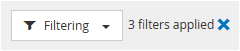

= Filtrar datos en las páginas rendimiento de inventario de objetos
:allow-uri-read: 
:icons: font
:imagesdir: ../media/

[role="lead"]
Puede filtrar datos en las páginas rendimiento de inventario de objetos para localizar rápidamente datos según criterios específicos. Puede utilizar el filtrado para restringir el contenido de las páginas rendimiento de inventario de objetos para mostrar sólo los resultados especificados. Esto proporciona un método muy eficiente para mostrar solo los datos de rendimiento de los que le interesa.

== Acerca de esta tarea

Puede utilizar el panel filtrado para personalizar la vista de cuadrícula en función de sus preferencias. Las opciones de filtro disponibles se basan en el tipo de objeto correlacionado que se está visualizando en la cuadrícula. Si se aplican filtros actualmente, aparece un asterisco (*) a la izquierda del control Filtering.

Se admiten cuatro tipos de parámetros de filtro.

|===
| Parámetro | Validación 

 a| 
Cadena (texto)
 a| 
Los operadores son *contiene* y *comienza con*.

 a| 
Número
 a| 
Los operadores son *superiores a* y *inferiores a*.

 a| 
Recurso
 a| 
Los operadores son *nombre contiene* y *nombre comienza con*.

 a| 
Estado
 a| 
Los operadores son *is* y *no*.

|===
Los tres campos son necesarios para cada filtro; los filtros disponibles reflejan las columnas filtrables en la página actual. El número máximo de filtros que puede aplicar es cuatro. Los resultados filtrados se basan en parámetros de filtro combinados. Los resultados filtrados se aplican a todas las páginas de la búsqueda filtrada, no sólo a la página mostrada actualmente.

Puede agregar filtros mediante el panel filtrado.

. En la parte superior de la página, haga clic en *filtrado*. Aparecerá el panel Filtering (filtrado).
. En el panel filtrado, haga clic en la lista desplegable de la izquierda y seleccione un nombre de objeto: Por ejemplo, _Cluster_ o un contador de rendimiento.
. Haga clic en la lista desplegable Centro y seleccione el operador booleano *nombre contiene* o *nombre comienza con* si la primera selección era un nombre de objeto. Si la primera selección era un contador de rendimiento, seleccione *mayor que* o *menor que*. Si la primera selección era *Estado*, seleccione *es* o *no es*.
. Si los criterios de búsqueda requieren un valor numérico, los botones de flecha arriba y abajo aparecen en el campo de la derecha. Puede hacer clic en los botones de flecha hacia arriba y hacia abajo para mostrar el valor numérico deseado.
. Si es necesario, escriba los criterios de búsqueda no numéricos en el campo de texto de la derecha.
. Para agregar filtros, haga clic en *Agregar filtro*. Aparecerá un campo de filtro adicional. Complete este filtro utilizando el proceso descrito en los pasos anteriores. Tenga en cuenta que al añadir el cuarto filtro, el botón *Agregar filtro* ya no aparece.
. Haga clic en *aplicar filtro*. Las opciones de filtro se aplican a la cuadrícula y se muestra un asterisco (*) en el botón filtrado.
. Utilice el panel filtrado para eliminar filtros individuales haciendo clic en el icono de papelera situado a la derecha del filtro que se va a eliminar.
. Para eliminar todos los filtros, haga clic en *Restablecer* en la parte inferior del panel de filtrado.

== Ejemplo de filtrado

La ilustración muestra el panel filtrado con tres filtros. El botón *Agregar filtro* aparece cuando tiene menos de cuatro filtros como máximo.

image::../media/opm-filtering-panel-draft-3.gif[borrador del panel de filtrado de opm 3]

Después de hacer clic en *aplicar filtro*, el panel filtrado se cierra y aplica los filtros.

