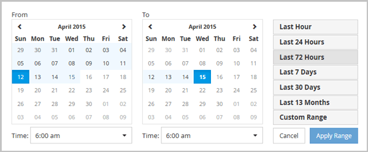

= Especificación de un intervalo de tiempo personalizado
:allow-uri-read: 
:icons: font
:imagesdir: ../media/

[role="lead"]
La página Performance Explorer permite especificar el intervalo de fecha y hora para los datos de rendimiento. Especificar un rango de tiempo personalizado proporciona mayor flexibilidad que el uso de intervalos de tiempo predefinidos al afinar los datos de objetos del clúster.

== Acerca de esta tarea

Puede seleccionar un intervalo de tiempo entre una hora y 390 días. 13 meses equivale a 390 días porque cada mes se cuenta como 30 días. La especificación de un intervalo de fechas y horas proporciona más detalles y le permite ampliar determinados eventos de rendimiento o series de eventos. La especificación de un intervalo de tiempo también ayuda a solucionar problemas potenciales de rendimiento, ya que al especificar un intervalo de fecha y tiempo se muestran los datos que rodean el evento de rendimiento con más detalle. Utilice el control *intervalo de tiempo* para seleccionar intervalos de fecha y hora predefinidos o especifique su propio intervalo de fecha y hora personalizado de hasta 390 días. Los botones de los intervalos de tiempo predefinidos varían de *última hora* a *últimos 13 meses*.

Al seleccionar la opción *últimos 13 meses* o especificar un intervalo de fechas personalizado superior a 30 días, se muestra un cuadro de diálogo en el que se informa de que los datos de rendimiento mostrados durante un período superior a 30 días se registran utilizando promedios por hora y no un sondeo de datos de 5 minutos. Por lo tanto, podría producirse una pérdida de granularidad visual de la línea de tiempo. Si hace clic en la opción *no volver a mostrar* del cuadro de diálogo, el mensaje no aparece cuando selecciona la opción *últimos 13 meses* o especifica un intervalo de fechas personalizado superior a 30 días. Los datos de resumen también se aplican en un intervalo de tiempo menor, si el intervalo de tiempo incluye una hora/fecha que es superior a 30 días a partir de hoy.

Al seleccionar un intervalo de tiempo (personalizado o predefinido), los intervalos de tiempo de 30 días o menos se basan en muestras de datos de intervalo de 5 minutos. Los intervalos de tiempo superiores a 30 días se basan en muestras de datos de intervalo de una hora.

. Haga clic en el cuadro desplegable *intervalo de tiempo* y aparecerá el panel intervalo de tiempo.
. Para seleccionar un intervalo de tiempo predefinido, haga clic en uno de los botones *última...* situados a la derecha del panel *intervalo de tiempo*. Al seleccionar un intervalo de tiempo predefinido, se dispone de datos de hasta 13 meses. El botón de intervalo de tiempo predefinido que ha seleccionado se resalta y los días y la hora correspondientes se muestran en los calendarios y selectores de tiempo.
. Para seleccionar un intervalo de fechas personalizado, haga clic en la fecha de inicio en el calendario *de* de la izquierda. Haga clic en *<* o *>* para navegar hacia delante o hacia atrás en el calendario. Para especificar la fecha de finalización, haga clic en una fecha del calendario *a* de la derecha. Tenga en cuenta que la fecha de finalización predeterminada es hoy a menos que especifique una fecha de finalización diferente. El botón *intervalo personalizado* situado a la derecha del panel intervalo de tiempo está resaltado, lo que indica que ha seleccionado un intervalo de fechas personalizado.
. Para seleccionar un intervalo de tiempo personalizado, haga clic en el control *Time* situado debajo del calendario *from* y seleccione la hora de inicio. Para especificar la hora de finalización, haga clic en el control *Time* situado debajo del calendario *to* de la derecha y seleccione la hora de finalización. El botón *intervalo personalizado* situado a la derecha del panel intervalo de tiempo está resaltado, lo que indica que ha seleccionado un intervalo de tiempo personalizado.
. Opcionalmente, puede especificar las horas de inicio y finalización al seleccionar un intervalo de fechas predefinido. Seleccione el intervalo de fechas predefinido como se ha descrito anteriormente y, a continuación, seleccione las horas de inicio y de finalización como se ha descrito anteriormente. Las fechas seleccionadas se resaltan en los calendarios, las horas de inicio y finalización especificadas aparecen en los controles *Time* y el botón *Custom Range* se resalta.
. Después de seleccionar el intervalo de fecha y hora, haga clic en *aplicar rango*. Las estadísticas de rendimiento de ese intervalo de tiempo se muestran en los gráficos y en la escala de tiempo de eventos .

