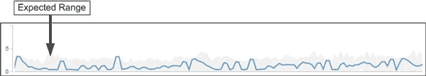

= Cómo se utiliza el rango esperado en el análisis de rendimiento
:allow-uri-read: 
:icons: font
:imagesdir: ../media/

[role="lead"]
Unified Manager utiliza el rango esperado para representar la latencia de I/o típica (tiempo de respuesta) y la actividad de IOPS (operaciones) en las cargas de trabajo supervisadas. Alerta cuando la latencia real de una carga de trabajo supera los límites superiores del rango esperado, lo que activa un evento de rendimiento, para poder analizar el problema de rendimiento y tomar medidas correctivas para resolverlo.

El rango esperado establece el nivel de rendimiento para la carga de trabajo. Con el tiempo, Unified Manager aprende de las mediciones de rendimiento anteriores para pronosticar los niveles de rendimiento y actividad esperados para la carga de trabajo. El límite superior del rango esperado establece el umbral de rendimiento. Unified Manager utiliza la base para determinar cuándo la latencia o las operaciones reales están por encima o por debajo de un umbral, o fuera de los límites de su rango esperado. La comparación entre los valores reales y los valores esperados crea un perfil de rendimiento para la carga de trabajo.

Cuando la latencia real de una carga de trabajo supera el umbral de rendimiento, debido a la contención en un componente del clúster, la latencia es alta y la carga de trabajo se ejecuta más lentamente de lo esperado. El rendimiento de otras cargas de trabajo que comparten los mismos componentes del clúster también puede ser más lento de lo esperado.

Unified Manager analiza el evento de umbral que cruza y determina si la actividad es un evento de rendimiento. Si la actividad de alta carga de trabajo continúa siendo constante durante un largo periodo de tiempo, como varias horas, Unified Manager considera que la actividad es normal y ajusta de forma dinámica el rango esperado para formar el nuevo umbral de rendimiento.

Es posible que algunas cargas de trabajo tengan una actividad baja consistente, donde el rango esperado de las operaciones o la latencia no tenga una tasa alta de cambio con el tiempo. Para minimizar el número de alertas de eventos, Unified Manager activa un evento solo en volúmenes de baja actividad cuyas operaciones y latencias son mucho más altas de lo esperado durante el análisis de eventos de rendimiento.

En este ejemplo, la latencia de un volumen tiene un rango esperado, en gris, de 0 milisegundos por operación (ms/op) a su nivel más bajo y 5 ms/op a su mayor. Si la latencia real, en azul, aumenta de repente a 10 ms/op, debido a un pico intermitente en el tráfico de red o contención en un componente del clúster, este supera el rango esperado y supera el umbral de rendimiento.

Cuando se redujo el tráfico de red o el componente del clúster ya no es objeto de disputa, la latencia regresa dentro del rango esperado. Si la latencia permanece en o por encima de los 10 ms/op durante un largo periodo de tiempo, es posible que deba tomar la acción correctiva para resolver el evento.
