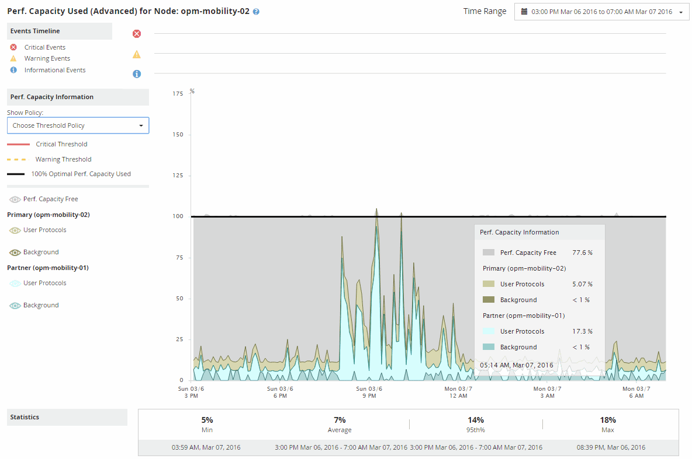

= Usar el gráfico de desglose de capacidad de rendimiento utilizada para la planificación de conmutación por error
:allow-uri-read: 
:icons: font
:imagesdir: ../media/

[role="lead"]
El gráfico detallado capacidad de rendimiento utilizada - desglose muestra la capacidad de rendimiento utilizada para el nodo principal y el nodo del partner. También muestra la cantidad de capacidad de rendimiento libre en el nodo de toma de control estimado. Esta información le ayuda a determinar si podría tener un problema de rendimiento si falla el nodo del partner.

== Acerca de esta tarea

Además de mostrar la capacidad de rendimiento total utilizada para los nodos, el gráfico Breakdown los valores para cada nodo en los protocolos de usuario y procesos en segundo plano.

* Los protocolos de usuario son las operaciones de I/o desde las aplicaciones de usuario hacia y desde el clúster.
* Los procesos en segundo plano son los procesos internos del sistema implicados en la eficiencia del almacenamiento, la replicación de datos y el estado del sistema.

Este nivel adicional de detalle permite determinar si un problema de rendimiento está provocado por la actividad de las aplicaciones de usuario o por los procesos del sistema en segundo plano, como la deduplicación, la reconstrucción de RAID, el filtrado de discos y las copias SnapMirror.

== Pasos

. Vaya a la página *Performance/Node Failover Planning* para el nodo que servirá como nodo de toma de control estimado.
. En el selector *intervalo de tiempo*, elija el período de tiempo durante el cual se muestran las estadísticas históricas en la cuadrícula de contadores y en los gráficos de contadores.
+
Se muestran los gráficos de contadores con estadísticas del nodo principal, nodo del partner y nodo de toma de control estimado.

. En la lista *elegir gráficos*, seleccione *Perf. Capacidad utilizada*.
. En el campo *Perf. Gráfico Capacity used*, seleccione *Breakdown* y haga clic en *Zoom View*.
+
El gráfico detallado de rendimiento. Se muestra la capacidad utilizada.

+

. Mueva el cursor por el gráfico detallado para ver la información sobre capacidad de rendimiento utilizada en la ventana emergente.
+
Rendim. El porcentaje libre de capacidad es la capacidad de rendimiento disponible en el nodo de toma de control estimado. Indica la cantidad de capacidad de rendimiento que queda en el nodo que toma el control tras una conmutación al respaldo. Si es 0 %, una conmutación al nodo de respaldo provocará que la latencia aumente hasta un nivel inaceptable en el nodo de respaldo.

. Considere tomar medidas correctivas para evitar un porcentaje libre de capacidad de rendimiento baja.
+
Si tiene pensado iniciar una conmutación al respaldo para el mantenimiento de nodos, elija una hora para conmutar al nodo del partner cuando el porcentaje libre de capacidad de rendimiento no sea 0.

